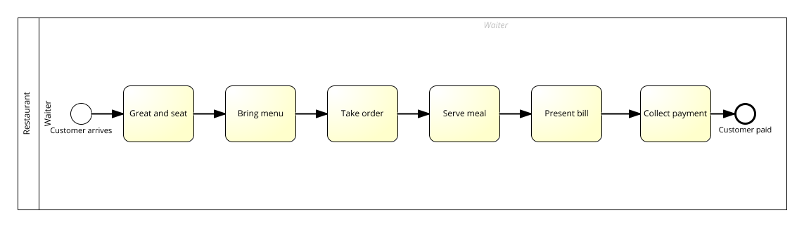

# Process Thinking
*Exercises for the [FutureLearn "Process Thinking" course](https://www.futurelearn.com/courses/business-process-management)*

This document provides solution examples for all exercises of the [FutureLearn "Process Thinking" course](https://www.futurelearn.com/courses/business-process-management), listed by lesson number (not all lessons contain exercises).

## 1.3: [Redesigning a business process – Ford Motor Company](https://www.futurelearn.com/courses/business-process-management/1/steps/104174/)

The goal of this exercise is to suggests process improvements for the *Ford* case study.

To fix the purchase & payment issue: Track the states of purchase orders, shipping receipts and invoices in a central relational database and have a computer system reporting the discrepancies. Establish troubleshooting processes for the most common issues that occur.
To lower production costs: Analyze all production steps and states and identify bottlenecks, unnecessary waiting times and unnecessary stock piles. Re-engineer the processes to be more efficient and lean.

## 1.5: [What is a process?](https://www.futurelearn.com/courses/business-process-management/1/steps/104176/)

The goal of this exercise is to identify processes based on a set of activities.

Based on the activities in the video, we can identify two processes.

### Customer arrival-to-cash

**Textual description**
One or multiple waiters carry out the following activities in sequential order:
- Greet and seat
- Bring menu
- Take order
- Serve meal
- Present bill
- Collect payment

**Diagram**

To add more details, we can add **intermediate message events** (for example: *Payment request comes in*) and model the customer as a **collapsed pool**.

### Clean kitchen (or, in end-to-end style: Kitchen: dirty-to-clean)
This is not a well-structured process, so we need *adaptive case management* here.
When modeling the process in BPMN, we could use an ad-hoc subprocess:

Or we could model the process in [CMMN](http://www.omg.org/spec/CMMN/1.0/).

As you can see above, modeling this process as more than a simple check list of activities is over-engineering and produces rather ridiculous results.

## 1.6: [Our definition of a business process](https://www.futurelearn.com/courses/business-process-management/1/steps/104178/)

The goal of this exercise is to provide an example of *weak links* in processes.

An extreme example for weak links are customer support processes gone bad.
As a customer, I sometimes call a customer support number and wait around 10 minutes in a loop before getting access to a human who then just tells me to call a different customer support number to reach the department that can address my issue.
My personal high score was calling four different numbers before reaching a person who actually handled my complaint.

## 1.7: [Share a process](https://www.futurelearn.com/courses/business-process-management/1/steps/104177)

The goal of this exercise is to provide an example of a business process and to specify
* triggers,
* participants,
* IT systems,
* customer value.

A simple technical customer support process (email).

### Textual description

* A customer (collapsed pool) sends a support request (event).
* The CRM system (lane) responds with a generic 'Thank you for your request' email (task).
* A 1st level support engineer (lane) assesses the case (task).
* If they can handle the case themselves (data-based exclusive gateway), they resolve the issue and respond (task).
* Otherwise, they escalate the case to a specialist (task).
* Then, the specialist (lane) solves the case and responds (task).

### Diagram

### Key facts

**Trigger**:

Request comes in

**Actors**:

* Customer
* 1st level support engineer
* 2nd level support engineer
* (CRM system)

**Customer**:

For example, a customer of a Internet service provider

**Value**:

* Resolves technical issue for the customer
* Enables Internet service provide to provide (more) value to the customer

## 1.8: [What would you do?](https://www.futurelearn.com/courses/business-process-management/1/steps/104179)

The goal of this exercise is to reflect on one's experiences as a service a product consumer from a BPM perspective.

Some airlines have poor processes when you miss connecting flights. Here's one example of a non-budget airline:

I missed a connecting flight (it was the airline's fault) and I needed to stay in an expensive but unappealing city over night.
The airline issued a food coupon and sent me to a hotel where I could stay for free.
However, the food coupon wasn't enough to get a decent meal at the airport.
At the hotel, I was told I needed to wait until dinner (several hours) before I could get free access to food or even beverages (water). I didn't have the means to pay for anything in this country (I didn't expect to leave the airport there), so I needed to wait some hours before I got access to drinking water.
The next morning, the cab that picked me up (they managed the timing) got stuck in a traffic jam. I was lucky to be able to catch the flight then.

The airline could improve the process :
- Issue a more generous food coupon.
- Offer free beverages (water) in the hotel.
- Book hotels closer to the airport to avoid problems with traffic jams.

The costs of the new process are higher on first glance, but lead to increased customer satisfaction and consequently less complaints and less churn.

## 1.10: [Process improvement](https://www.futurelearn.com/courses/business-process-management/1/steps/104181)

The goal of this exercise is to describe the strategic goal behind a set of process change options and to develop further process improvement suggestions.

* **Increase operational efficiency**
  Automate, re#sequence, standardize (although the latter is categorized as *Increase cost efficiency* in the video)

* **Improve customer experience**
  Build infrastructure

* **Increase cost efficiency**
  Outsource to customer, standardize, eliminate cooking, eliminate waiters

Further examples are:
* Increase operational efficiency and customer experience through allowing the customer to pre-order from home.
* Increase cost efficiency through a optimizing the variety of the menu based on a restricted set of ingredients (less waste).

## 1.12: [IT Help Desk Case Study](https://www.futurelearn.com/courses/business-process-management/1/steps/104184)

The goal of this exercise is to resolve the issues the case study presents through re-engineering the *IT help desk* process.

1. **Cases take too long**: There are 50 cases per day for five 1st level support workers. Let's assume they work eight hours a day. That means, a 1st level support worker uses on average 48 minutes per case. Consequently, we can assume that the cases are complex and need experience to solve. To speed the process up, we should hire less 1st level support workers and more 2nd level specialist. And to keep the customer from calling, we should send out regular automatic status updates.
2. **Status of cases is unclear**: Add the status `in progress by 2nd level support`, so the 1st level staff can see whether a ticket is waiting/stuck or about to be resolved.
3. **Requests with status `open` are actually already resolved**: Automate the solution confirmation. Every email with a proposed solution should contain a link button (a green button that says *Confirm the issue is resolved* or similar). When the user clicks the button, the case is automatically set to `resolved`. If a customer doesn't reply to a proposed solution for more than three weeks, the system sets the case status to `expired`.

## 1.14: [What else besides transparency?](https://www.futurelearn.com/courses/business-process-management/1/steps/104186/)

The goal of this exercise is to explain how the items in each tuple of process characteristics as explained in the video relate to each other.

The values are organized in pairs, because each pair represents two ends of a spectrum.
Typically, you must...
* ...sacrifice quality (cut costs) to increase efficiency.
* ...sacrifice compliance (e.g. follow a standardized procedure) to gain agility.
* ...sacrifice networking (making it harder for a customer to reach a specific person) to streamline communication structures (integration).

## 1.15: [Which values matter most?](https://www.futurelearn.com/courses/business-process-management/1/steps/104187)

The goal of this exercise is to explain why the process characteristics (values) as explained in the video matter.

From a theoretical business perspective, efficiency (that means: return on investment) is the top priority. All other attributes impose requirements you need to take into account to be able to optimize efficiency.

Practically, the attributes are equally important.
For example:
* On the long term, you (hopefully) can't run a business without being compliant.
* Your business might depend on top-notch knowledge workers, who will leave if you don't enable them to deliver high-quality work.
* Your customers will leave to a faster moving competitor if you are not agile enough.

## 1.18: [Identifying a process](https://www.futurelearn.com/courses/business-process-management/1/steps/104189/)

The goal of this exercise is to identify and evaluate a process from a customer's perspective.

Patient onboarding at a medical specialist practice (in Germany):
You typically have to provide your health insurance card AND fill out a paper-based form with your general personal data and some important health specifica.
Of course, the data provides value (i.e. prevents incorrect treatment).
However, it wasn't necessary (could be done more easily) if we had properly working electronic health records.
On the other hand, electronic health records have serious data security and privacy implications.

## 2.9: Simple Process Modelling

**Scenario 1**

The following diagram depicts the *Order book* process (not the order-to-delivery process) from a customer's perspective:

I kept the diagram rather simple.
One could add, for example:
* A collapsed pool that represents the online book store. However, modeling each request with messages/message flows would go too far.
* More deviations from the most common paths (invalid login, adjust payment details, etc.).
